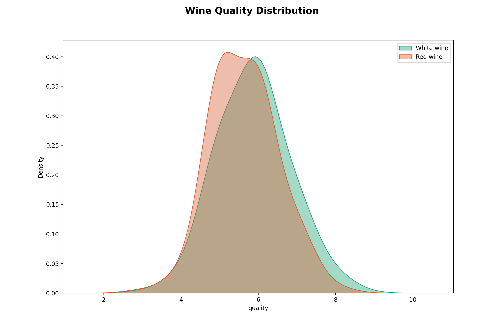
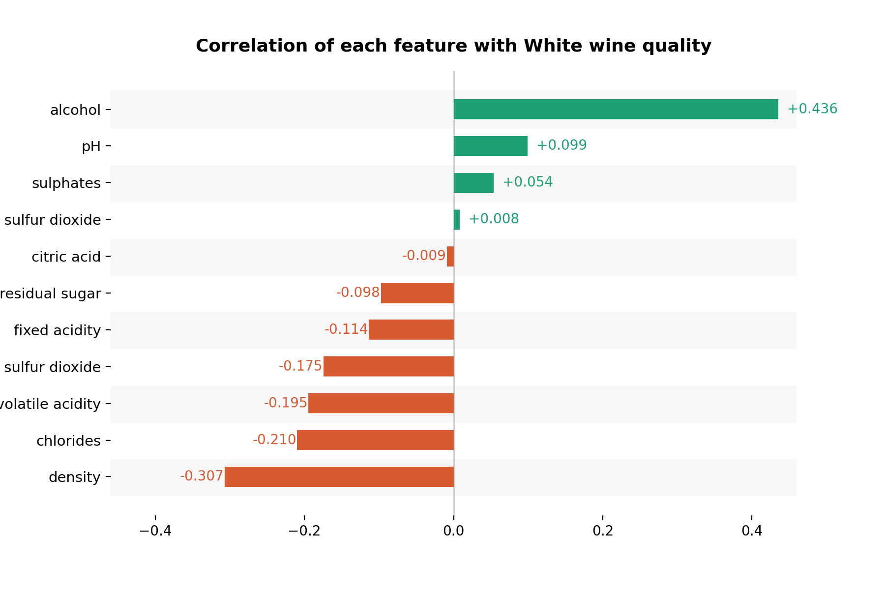
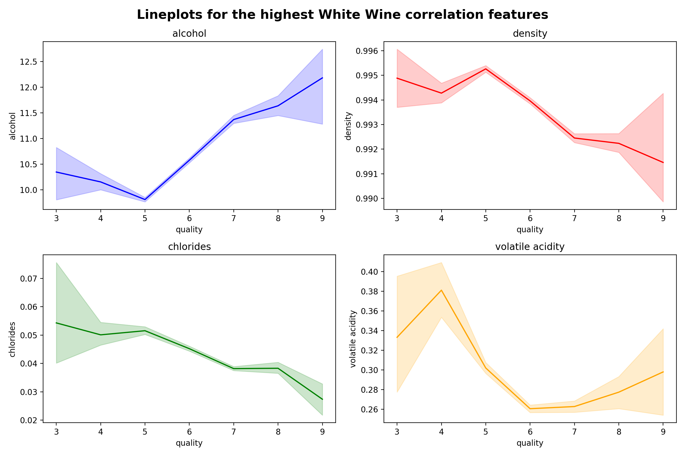
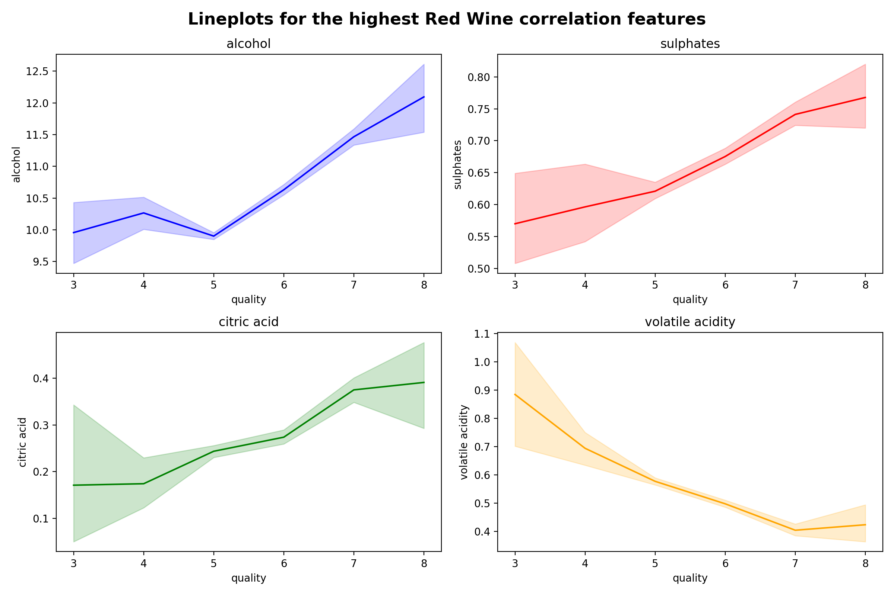
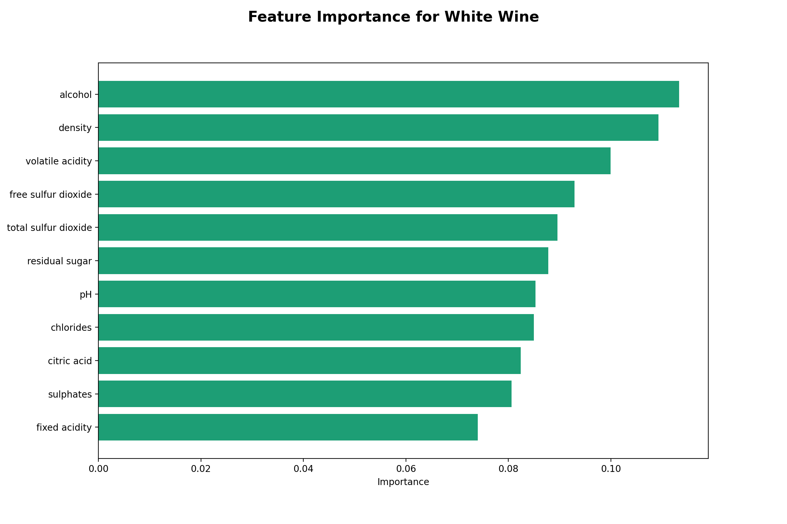
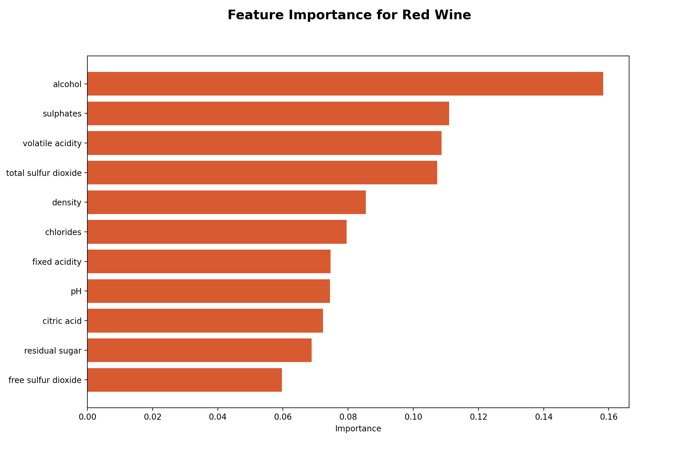
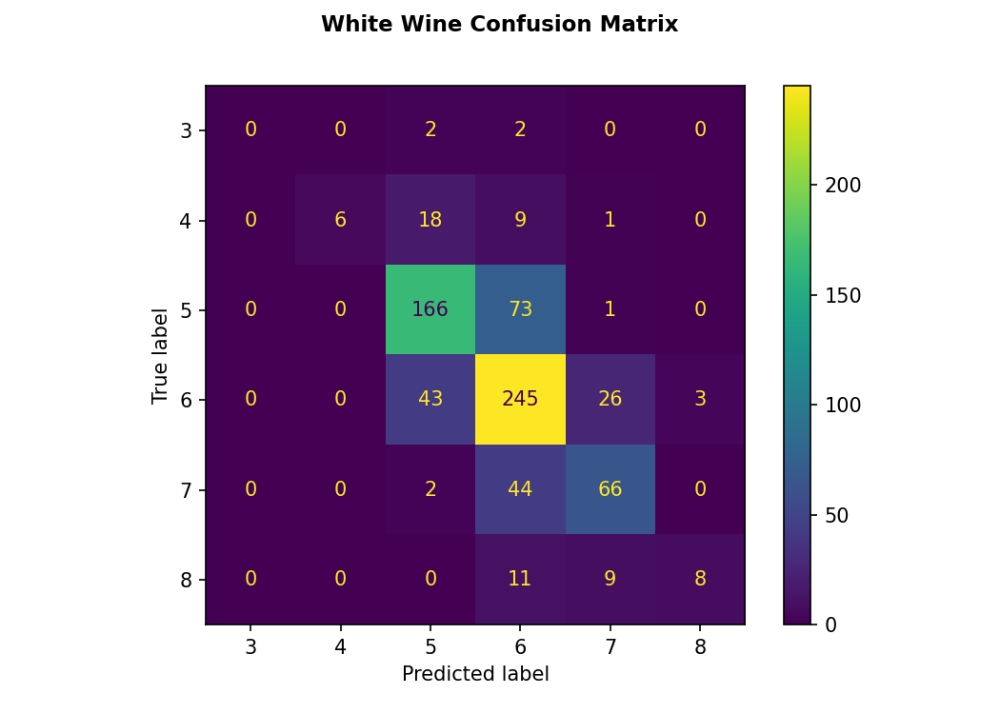
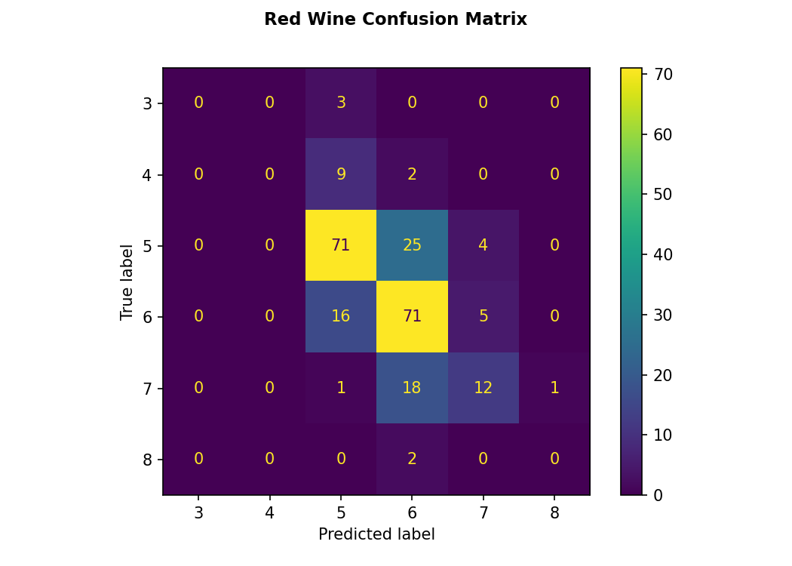

# Wine Quality Analysis Report

## Summary

This report presents an analysis of two wine quality datasets (red and white wine) with the goal of identifying which properties are most predictive of wine quality and building a random forest model to predict quality scores.

Analysis revealed that **alcohol content** is the single strongest positive predictor of quality in both wine types, with a correlation of +0.48 for red wine and +0.44 for white wine. **Volatile acidity** is the strongest negative predictor for red wine (–0.39), while **density** is the strongest negative predictor for white wine (–0.31). Sulphates show a meaningful positive effect in red wines but are less important in white wines.

Random Forest classifiers were trained for both wine types using a 15% held-out test set. The white wine model achieved **67% accuracy** and the red wine model achieved **64% accuracy**. Both models perform best on the dominant quality classes (5 and 6) and struggle with minority classes at the extremes (3, 4, and 8+).

---

## Introduction

The dataset contains **1,599 red wine** and **4,898 white wine** samples. Each sample has 11 features and a quality score from 3–9 assigned by wine experts:

- Fixed acidity, volatile acidity, citric acid
- Residual sugar, chlorides
- Free and total sulfur dioxide
- Density, pH, sulphates, alcohol

The analysis pipeline runs: (1) exploratory data analysis and correlation analysis, (2) feature importance visualisation, and (3) training and evaluation of Random Forest classifiers using GridSearchCV for hyperparameter tuning.

---

## Exploratory Data Analysis

### Dataset Overview

|                  | Red Wine | White Wine |
|------------------|----------|------------|
| Samples          | 1,599    | 4,898      |
| Features         | 11       | 11         |
| Quality Range    | 3 – 8    | 3 – 9      |
| Mean Quality     | 5.64     | 5.88       |
| Mean Alcohol (%) | 10.42    | 10.51      |

### Quality Distribution

Both datasets are imbalanced — the vast majority of samples are rated 5 or 6, with very few examples of extreme quality (3, 4, or 8+). This class imbalance impacts model performance on rare quality levels.

*Figure 1: Quality score distributions for red wine and white wine*

## Feature Correlations with Quality

### White Wine

*Figure 2: Correlation of each feature with white wine quality. Green bars = positive, red = negative.*

For white wine, alcohol has the highest positive correlation with quality (+0.44). Density (–0.31) and chlorides (–0.21) are the strongest negative predictors. Total and free sulfur dioxide show little correlation with perceived quality.

*Figure 3: Feature correlation lineplot for white wine*

### Red Wine

*Figure 4: Correlation of each feature with red wine quality. Green bars = positive, red = negative.*

Red wine shows a similar pattern, with alcohol the top positive predictor (+0.48). Volatile acidity has a strong negative relationship (–0.39). Sulphates show a meaningful positive correlation (+0.25).

*Figure 5: Feature correlation lineplot for red wine*

---

## Model: Random Forest Classifier

### Methodology

A Random Forest classifier was trained for each wine type separately. The dataset was split 85/15 (train/test) with `random_state=101`. GridSearchCV was used to search over the following hyperparameter grid:

| Parameter      | Values              |
|----------------|---------------------|
| n_estimators   | 64, 100, 128, 200   |
| max_features   | 2, 3, 4             |
| bootstrap      | True, False         |
| oob_score      | True, False         |

### Feature Importances

Feature importance scores confirm the correlation findings. Alcohol is the most important predictor in both models. For red wine, sulphates and volatile acidity rank highly. For white wine, density and free sulfur dioxide join alcohol and volatile acidity as top contributors.

*Figure 6: Feature importances – white wine*

*Figure 7: Feature importances – red wine*

### Model Performance

Both models achieve around 67% accuracy — reasonable for a 6-class classification problem with significant class imbalance. Performance is strong on quality classes 5 and 6 (which dominate the training data) but the models fail to predict the rare extreme quality levels (3, 4, and 8) due to insufficient training examples.

#### White Wine – Confusion Matrix

*Figure 7: Confusion matrix for white wine model (test set, n=735)*

#### Red Wine – Confusion Matrix

*Figure 8: Confusion matrix for red wine model (test set, n=240)*

---

## Conclusion

The key drivers of wine quality are consistent across both wine types:

- **Alcohol content**: the strongest single predictor — higher alcohol tends to mean higher quality.
- **Volatile acidity** (red wine): high acetic acid is a marker of lower quality.
- **Density** (white wine): inversely correlated with quality.
- **Sulphates** (red wine): moderate positive effect on quality.
